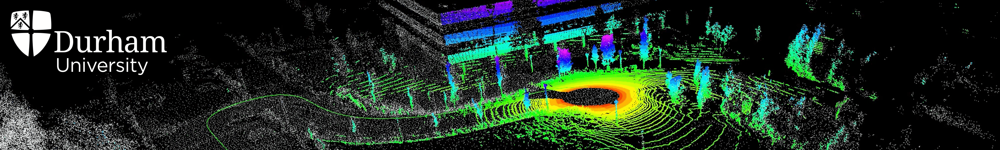

 

Hey, thanks for stopping by! 👋

I am a PhD researcher in the [Department of Computer Science](https://www.durham.ac.uk/departments/academic/computer-science/) at [Durham University](https://www.dur.ac.uk), supervised by Prof [Toby Breckon](https://breckon.org/toby/) and Prof [Hubert P. H. Shum](http://hubertshum.com/). My research interests are **geometric & semantic scene understanding** for **autonomous road vehicles**. I'm currently the Student Member of [IEEE](https://www.ieee.org/)/[CVF](https://www.thecvf.com/).

Prior to Durham, I received my bachelor's degree in Telecommunications Engineering at [Nanjing University of Science and Technology](https://www.njust.edu.cn) (NJUST) in 2020. In NJUST, I used to work on semantic scene understanding for UAVs and UGVs with Prof Hong Gu.

As an enthusiast of open source projects, I maintain and contribute to a number of open source repositories.

I am incredibly thankful to my supervisors and collaborators, and enjoy exploring new domains through collaborations. If you have questions or would like to work together, please feel free to reach out through [email](mailto:li.li4@durham.ac.uk) or grab some time with me for [an appointment](https://www.luisli.org/appointment/) either online or in person.

